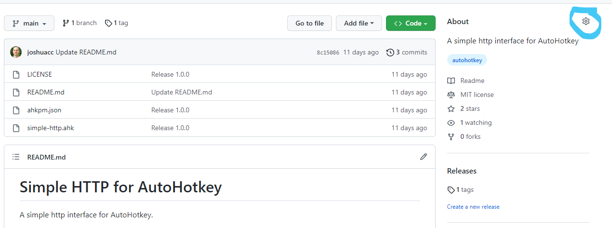

<aside class="alert alert-warning">

This guide assumes a basic familiarity with git and GitHub. If you're not yet
familiar with those, consult [GitHub's Quickstart](https://docs.github.com/en/get-started/quickstart/hello-world).

</aside>

## Create a GitHub repository

If your libary isn't already stored in a GitHub repository, go ahead and
[create one](https://github.com/new) and add your code to it.

## Add an ahkpm.json file

In the top level folder of your git repository, run `ahkpm init` and answer
the prompts that it gives you.

Once that is added, be sure to commit the new `ahkpm.json` file and push the
commit to GitHub.

## Use git tags to publish versions

Assuming that the version of the library you want to release is at version `1.0.0`,
create a new git tag for it by running `git tag 1.0.0`. Then push it to GitHub
by running `git push origin 1.0.0`.

Each time you are ready to publish a new version, follow those same steps,
substituting the new version name.

## Add it to the packages list

On your library's GitHub repository, click the gear icon next to the "About" header.

In the dialog box that appears, add the topic `ahkpm-package`, as well as a
brief description of the package, then click the "Save changes" button.

After adding the `ahkpm-package` topic, your package is findable via `ahkpm search`.
And sometime in the next 24 hours, it will also show up on the [Packages page](/packages),
using the description you provided.
